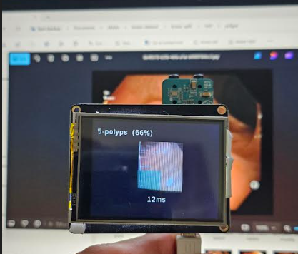

# Realtime classification of GI images using Analog Devices MAX78000FTHR AI platform

Description
-----------
Artificial Intelligence (AI) plays a crucial role in the real-time classification of gastrointestinal (GI) tract images, significantly enhancing diagnostic accuracy and efficiency. By leveraging advanced machine learning algorithms, AI systems can analyze vast amounts of endoscopic and colonoscopic images swiftly, identifying abnormalities such as polyps, ulcers, and tumors with high precision. This real-time analysis aids gastroenterologists in making quicker and more accurate diagnoses, potentially leading to earlier detection of GI diseases and improved patient outcomes. Moreover, AI-driven classification reduces the workload on medical professionals, allowing them to focus on more complex cases and patient care. The integration of AI in GI imaging not only streamlines the diagnostic process but also holds promise for advancing personalized medicine and improving overall healthcare quality

This project leverages the Kvasir dataset (https://datasets.simula.no/kvasir ver. 1), which contains 4000 gastrointestinal  images, to train a compact model with 62,000 parameters. This model is then quantized and deployed on the MAX78000 microcontroller, specifically using the MAX78000FTHR platform. The platform, equipped with a camera, captures real-time images, runs inference, and displays classification results on serial port and TFT display. By training the model on six distinct classes, the project aims to provide efficient and accurate real-time classification of GI images, demonstrating the potential of edge AI in medical diagnostics. This approach not only enhances the speed and accuracy of GI image analysis but also showcases the feasibility of deploying AI models on power-constrained devices for real-world applications.

## Setup
1. Install MAX78000 AI training and synthesis tools from:

* https://github.com/analogdevicesinc/ai8x-training
* https://github.com/analogdevicesinc/ai8x-synthesis

2. Copy the included ai8x-training and ai8x-synthesis in this repo to the installed training and synthesis tools.

3. Install ADI Software Development kit from:
* https://www.analog.com/en/products/max78000.html#tools-header 

## Model
For this project a small model with 62,000 parameters is chosen, which was initially used to classify cats and dogs images:

      
      
      
        class AI85CatsDogsNet(nn.Module):
    """
    Define CNN model for image classification.
    """
    def __init__(self, num_classes=2, num_channels=3, dimensions=(128, 128),
                 fc_inputs=16, bias=False, **kwargs):
        super().__init__()

        assert dimensions[0] == dimensions[1]  # Only square supported

        # Keep track of image dimensions so one constructor works for all image sizes
        dim = dimensions[0]

        self.conv1 = ai8x.FusedConv2dReLU(num_channels, 16, 3,
                                          padding=1, bias=bias, **kwargs)
        # padding 1 -> no change in dimensions -> 16x128x128

        pad = 2 if dim == 28 else 1
        self.conv2 = ai8x.FusedMaxPoolConv2dReLU(16, 32, 3, pool_size=2, pool_stride=2,
                                                 padding=pad, bias=bias, **kwargs)
        dim //= 2  # pooling, padding 0 -> 32x64x64
        if pad == 2:
            dim += 2  # padding 2 -> 32x32x32

        self.conv3 = ai8x.FusedMaxPoolConv2dReLU(32, 64, 3, pool_size=2, pool_stride=2, padding=1,
                                                 bias=bias, **kwargs)
        dim //= 2  # pooling, padding 0 -> 64x32x32

        self.conv4 = ai8x.FusedMaxPoolConv2dReLU(64, 32, 3, pool_size=2, pool_stride=2, padding=1,
                                                 bias=bias, **kwargs)
        dim //= 2  # pooling, padding 0 -> 32x16x16

        self.conv5 = ai8x.FusedMaxPoolConv2dReLU(32, 32, 3, pool_size=2, pool_stride=2, padding=1,
                                                 bias=bias, **kwargs)
        dim //= 2  # pooling, padding 0 -> 32x8x8

        self.conv6 = ai8x.FusedConv2dReLU(32, fc_inputs, 3, padding=1, bias=bias, **kwargs)

        self.fc = ai8x.Linear(fc_inputs*dim*dim, num_classes, bias=True, wide=True, **kwargs)

        for m in self.modules():
            if isinstance(m, nn.Conv2d):
                nn.init.kaiming_normal_(m.weight, mode='fan_out', nonlinearity='relu')

    def forward(self, x):  # pylint: disable=arguments-differ
        """Forward prop"""
        x = self.conv1(x)
        x = self.conv2(x)
        x = self.conv3(x)
        x = self.conv4(x)
        x = self.conv5(x)
        x = self.conv6(x)
        x = x.view(x.size(0), -1)
        x = self.fc(x)

        return x

## Dataset
The dataset that is used for training is taken from https://datasets.simula.no/kvasir/
The dataset file (kvasir-v1.zip) includes GI images. 
The model is trained to classify following classes:

* ulcerative-colitis
* esophagitis
* normal-cecum
* normal-pylorus
* normal-z-line
* polyps

After downloading the dataset, use **split_dataset.py** script to create test and train sets. 

        
        $python split_dataset.py kvasir-dataset 0.9 gastro

Copy the gastro folder to /ai8x-training/data

Only keep the desired classes in train and test folders.

## Dataloader (gastro.py)
The dataloader is located in ai8x-training/datasets/gastro.py

The desired c
lasses and the name of the image folder for each class is defined in this script:

        
        labels = ['esophagitis', 'normal-cecum', 'normal-pylorus', 'normal-z-line', 'polyps', 'ulcerative-colitis']
        label_to_id_map = {k: v for v, k in enumerate(labels)}
        label_to_folder_map = {'esophagitis':'esophagitis', 'normal-cecum':'normal-cecum', 'normal-pylorus':'normal-pylorus', 'normal-z-line':'normal-z-line', 'polyps':'polyps', 'ulcerative-colitis':'ulcerative-colitis'}
        

## Training
To train the model, use .\scripts\train_gastro.sh, or the following:

        (ai8x-training)$python train.py --epochs 50 --optimizer Adam -b 16 --lr 0.001 --wd 0 --deterministic --compress policies\schedule-catsdogs.yaml --qat-policy policies\qat_policy_cd.yaml --model ai85cdnet --dataset cats_vs_dogs --confusion --param-hist --embedding --device MAX78000
        

After training is complete, the final checkpoint is stored in logs folder:

        
        ...
		2024-09-30 23:44:14,915 - ==> Best [Top1: 88.519   Top5: 100.000   Sparsity:0.00   Params: 61872 on epoch: 180]
		2024-09-30 23:44:14,915 - Saving checkpoint to: logs\2024.09.30-202109\qat_checkpoint.pth.tar
		2024-09-30 23:44:14,915 - 
		
		2024-09-30 23:44:14,915 - Training epoch: 2430 samples (64 per mini-batch)
		2024-09-30 23:44:39,040 - Epoch: [199][   10/   38]    Overall Loss 0.144369    Objective Loss 0.144369                                        LR 0.000125    Time 2.412501    
		2024-09-30 23:44:45,852 - Epoch: [199][   20/   38]    Overall Loss 0.134443    Objective Loss 0.134443                                        LR 0.000125    Time 1.546855    
		2024-09-30 23:44:51,913 - Epoch: [199][   30/   38]    Overall Loss 0.145453    Objective Loss 0.145453                                        LR 0.000125    Time 1.233275    
		2024-09-30 23:44:56,969 - Epoch: [199][   38/   38]    Overall Loss 0.148206    Objective Loss 0.148206    Top1 92.063492    Top5 100.000000    LR 0.000125    Time 1.106670    
		2024-09-30 23:44:57,487 - --- validate (epoch=199)-----------
		2024-09-30 23:44:57,487 - 270 samples (64 per mini-batch)
		2024-09-30 23:45:15,181 - Epoch: [199][    5/    5]    Loss 0.534891    Top1 82.222222    Top5 100.000000    
		2024-09-30 23:45:15,699 - ==> Top1: 82.222    Top5: 100.000    Loss: 0.535
		
		2024-09-30 23:45:15,714 - ==> Confusion:
		[[42  0  1  4  0  0]
		 [ 0 35  0  0  3  2]
		 [ 2  0 36  1  1  0]
		 [16  0  0 30  0  0]
		 [ 0  7  2  0 35  3]
		 [ 0  2  1  0  3 44]]
		
		2024-09-30 23:45:15,714 - ==> Best [Top1: 88.519   Top5: 100.000   Sparsity:0.00   Params: 61872 on epoch: 180]
		2024-09-30 23:45:15,714 - Saving checkpoint to: logs\2024.09.30-202109\qat_checkpoint.pth.tar
		2024-09-30 23:45:15,714 - --- test ---------------------
		2024-09-30 23:45:15,714 - 300 samples (64 per mini-batch)
		2024-09-30 23:45:31,566 - Test: [    5/    5]    Loss 0.448745    Top1 84.666667    Top5 100.000000    
		2024-09-30 23:45:32,100 - ==> Top1: 84.667    Top5: 100.000    Loss: 0.449
		
		2024-09-30 23:45:32,100 - ==> Confusion:
		[[45  0  0  5  0  0]
		 [ 0 45  0  0  5  0]
		 [ 0  0 46  0  1  3]
		 [17  0  1 32  0  0]
		 [ 0  2  0  0 41  7]
		 [ 0  2  0  0  3 45]]
		
		2024-09-30 23:45:32,100 - 
		2024-09-30 23:45:32,100 - Log file for this run: C:\Users\daniel\Documents\ai8x-training\logs\2024.09.30-202109\2024.09.30-202109.log
        
        

## Quantization
Use ./scripts/quantize_gastro.sh or the following:

        (ai8x-synthesis)$python quantize.py ../ai8x-training/logs/2024.09.30-202109/qat_best.pth.tar ../ai8x-training/logs/2024.09.30-202109/qat_best_q8.pth.tar --device MAX78000 -v

The quantized checkpoint qat_best_q8.pth.tar will be created and copied to the same log folder.

## Evaluation
Use ./scripts/evaluate_gastro.sh or the following to evaluate the quantized checkpoint:

        (ai8x-training)$python train.py --model ai85cdnet --dataset gastro --confusion --evaluate --exp-load-weights-from ../ai8x-training/logs/2024.09.30-202109/qat_best_q8.pth.tar -8 --device MAX78000

## Synthesis
Use ./scripts/gen_gastro_max78000.sh script or the following to create the C code for our model with known answer test output:

        (ai8x-synthesis)$python ai8xize.py --test-dir sdk/Examples/MAX78000/CNN --prefix GASTRO_2024.09.30-202109 --checkpoint-file ../ai8x-training/logs/2024.09.30-202109/qat_best_q8.pth.tar --config-file networks/cats-dogs-hwc.yaml --fifo --softmax --device $DEVICE --timer 0 --display-checkpoint --verbose

It will create a C project under sdk/Examples/MAX78000/CNN --prefix GASTRO_2024.09.30-202109 with one input sample data and expected output to test on HW:
+  Makefile
+  cnn.c
+  cnn.h
+  log.txt
+  main.c
+  project.mk
+  sampledata.h
+  sampleoutput.h
+  softmax.c
+  weights.h

## Run on MAXx78000FTHR
### Testing Known Answer Test code
First, build and flash the synthesised C project and check the printed output on terminal:

        make -r BOARD=FTHR_RevA
        openocd -s "${TOOLCHAIN_PATH}/OpenOCD/scripts" -f interface/cmsis-dap.cfg -f target/max78000_nsrst.cfg -c "program build/max78000.elf reset exit "

Use a serial terminal to check the output. The code runs inference on one sample input and checks the expected output:

    Waiting...
      
  	*** CNN Inference Test GASTRO_2024.09.30-202109_gastro6_64_noaug ***
	*** PASS ***
	Approximate data loading and inference time: 12482 us
	Classification results:
	[  41421] -> Class 0: 93.3%
	[-270472] -> Class 1: 0.0%
	[ -39049] -> Class 2: 2.9%
	[ -44744] -> Class 3: 2.9%
	[-120244] -> Class 4: 0.1%
	[ -73707] -> Class 5: 0.7%

### Testing Demo Code
Copy cnn.c, cnn.h, weights.h from the synthesised project to the gastro-demo project, rebuild and run.
The TFT display shows the classification result of images captured by camera:

<video src="/gastro_clip.mp4" width="600" height="400" controls></video>

https://github.com/user-attachments/assets/42596310-7528-4b45-9939-611b818da3f4

