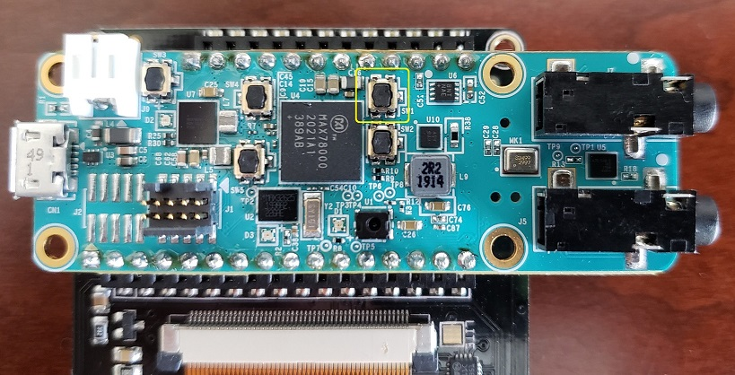

# MAX78000 Gastro Demo


Description
-----------

The model trained in this demo is used to classify GI images. For this demo, images from https://datasets.simula.no/kvasir/ ver 1 dataset are used. 
The model is trained to classify following classes:

* ulcerative-colitis
* esophagitis
* normal-cecum
* normal-pylorus
* normal-z-line
* polyps


The code uses a sampledata header (sampledata.h) file to test a pre-defined input sample. The example also supports live capture from camera module and displays the image on the TFT LCD.

## Software

### Project Usage

Universal instructions on building, flashing, and debugging this project can be found in the **[MSDK User Guide](https://analogdevicesinc.github.io/msdk/USERGUIDE/)**.

### Project-Specific Build Notes

* This project comes pre-configured for the MAX78000EVKIT.  See [Board Support Packages](https://analogdevicesinc.github.io/msdk/USERGUIDE/#board-support-packages) in the UG for instructions on changing the target board.

* This project supports output to a TFT display.  When building for the MAX78000EVKIT, the display is **enabled** by default.
    * To _disable_ the TFT display code, comment out `PROJ_CFLAGS += -DTFT_ENABLE` in [project.mk](project.mk)

        ```Makefile
        ifeq "$(BOARD)" "EvKit_V1"
        # PROJ_CFLAGS+=-DTFT_ENABLE
        IPATH += TFT/evkit/
        VPATH += TFT/evkit/
        endif
        ```

* When building for the MAX78000FTHR, the TFT display is **disabled** by default.  The compatible 2.4'' TFT FeatherWing is an optional display that does not come with the MAX7800FTHR.  It can be ordered [here](https://learn.adafruit.com/adafruit-2-4-tft-touch-screen-featherwing)

    * To _enable_ the TFT display code, uncomment `PROJ_CFLAGS += -DTFT_ENABLE` in [project.mk](project.mk)

        ```Makefile
        ifeq "$(BOARD)" "FTHR_RevA"
        # Only Enable if 2.4" TFT is connected to Feather
        PROJ_CFLAGS+=-DTFT_ENABLE
        IPATH += TFT/fthr
        VPATH += TFT/fthr
        endif
        ```

* By default, this project builds for ["offline" mode](#offline-mode), which uses a static "known answer" input.  To enable real-time captures in ["camera" mode](#camera-mode), comment out `#define USE_SAMPLEDATA` defined in [main.c](main.c).

## Hardware

### MAX78000EVKIT operations

*   If using camera and TFT LCD, connect OVM7692 camera board directly (without 90 degree adapter) to 'J4 Camera' header facing out and place TFT display on the display header.
*   Connect a USB cable between the PC and the CN1 (USB/PWR) connector.
*   Place jumper P0\_0 and P0\_1 on UART\_0\_EN header JH1.
*   Open a serial port application on the PC and connect to Ev-Kit's console UART at 115200, 8-N-1 configuration.

This demo is operated in two modes: Real-time data using Camera module or using sample image header file in offline mode.

In either mode, pushbutton trigger PB1(SW2) is used to capture and load an image into CNN engine. User is prompted to press PB1 to load an image

### MAX78000FTHR operations

User should use PC terminal program to observe **cats-dogs_demo** result as described in "Terminal output" section with help of the ascii art representation of the captured image.

This TFT display comes fully assembled with dual sockets for MAX78000 Feather to plug into.

While using TFT display keep its power switch in "ON" position. The TFT "Reset" button also can be used as Feather reset.
Press PB1 (SW1) button to start demo.


The PB1 (SW1) button is located as shown in picture bellow:



### Camera Mode

This mode uses OVM7692 camera module to capture an image in RGB888 format. Since the model is trained using 64x64 pixel image, the PCIF peripheral captures 64x64 pixel image and displays it on LCD.

